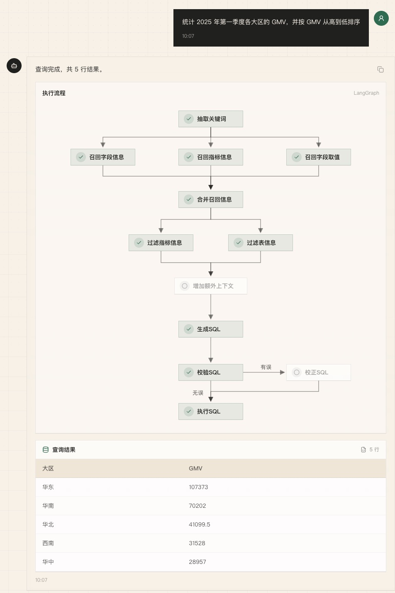
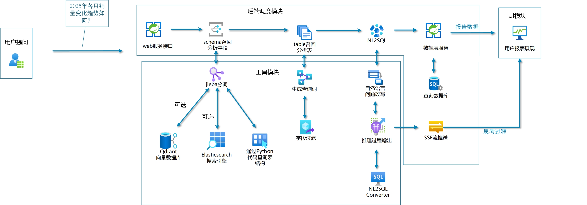

*-**************************
<div align="center">

# 电商智能问数 Agent

### Metadata RAG + NL2SQL

将电商经营问题转换为可执行 SQL，并实时展示检索、生成、校验和查询过程。


</div>



## 项目介绍

电商数据分析通常依赖分析人员理解数仓表结构、字段含义和指标口径。本项目面向自然语言问数场景，通过元数据检索增强和多阶段工作流，将用户问题转换为 SQL，在电商星型数仓中执行查询并返回结构化结果。

系统不会直接让模型凭空生成 SQL，而是先召回相关字段、业务指标和字段真实值，再补齐主外键、指标依赖、日期及数据库环境信息，形成受真实 Schema 约束的生成上下文。

## 核心能力

- **元数据 RAG**：围绕数据库 Schema、业务指标和字段真实值构建检索上下文。
- **三路并行召回**：字段与指标使用 Qdrant 向量检索，字段值使用 Elasticsearch 全文检索。
- **上下文组装**：按实体 ID 去重，并从 Meta MySQL 补齐指标依赖字段、主外键和值样例。
- **LangGraph 编排**：组织关键词抽取、并行召回、候选过滤、SQL 生成、校验和执行节点。
- **NL2SQL 链路**：基于表结构、指标口径、日期和数据库方言生成 SQL，并通过 MySQL `EXPLAIN` 检查可执行性。
- **实时进度展示**：FastAPI 通过 SSE 推送节点状态和最终结果，React 前端展示执行流程。
- **历史会话与续聊**：会话、消息、SQL、结果和执行步骤持久化到 Meta MySQL，支持刷新后恢复并基于最近上下文继续追问。
- **LangGraph 短期记忆**：Redis Checkpointer 按会话保存精简消息窗口、滚动摘要和最近 SQL 摘要，过期后可从 MySQL 历史懒恢复。

## 系统架构



项目包含两条核心链路：

### 1. 元数据索引构建

```text
配置文件 + DW MySQL
        │
        ├─ 表、字段、指标、依赖关系 ──→ Meta MySQL
        ├─ 字段名称/描述/别名 ────────→ Embedding ─→ Qdrant
        ├─ 指标名称/描述/别名 ────────→ Embedding ─→ Qdrant
        └─ 配置字段的真实取值 ─────────→ Elasticsearch
```

### 2. 在线问数工作流

```text
当前问题 + Redis Checkpoint 短期记忆
    ↓
独立问题改写
    ↓
关键词抽取
    ↓
字段召回 ─┬─ 指标召回 ─┬─ 字段值召回
          └──────┬──────┘
                 ↓
         召回结果合并与元数据补齐
                 ↓
          表过滤 + 指标过滤
                 ↓
          SQL 上下文构建
                 ↓
           SQL 生成与 EXPLAIN
                 ↓
          查询执行与结果返回
```

## 技术栈

| 模块 | 技术 | 职责 |
| --- | --- | --- |
| 工作流 | LangGraph | 状态传递、并行节点、条件路由 |
| 模型调用 | LangChain / OpenAI-compatible API | 查询扩展、候选过滤、SQL 生成与修正 |
| Embedding | TEI / BAAI/bge-large-zh-v1.5 | 字段、指标和查询文本向量化 |
| 向量检索 | Qdrant | 字段与指标语义召回 |
| 全文检索 | Elasticsearch / IK | 字段真实值检索 |
| 短期记忆 | Redis 8 / LangGraph Checkpointer | 线程级状态、消息窗口、摘要与重启恢复 |
| 数据存储 | MySQL / SQLAlchemy | 教学数仓、结构化元数据和 SQL 执行 |
| API | FastAPI / SSE | 查询接口与节点级进度推送 |
| 前端 | React / TypeScript / Vite / Tailwind CSS | 问数交互、流程状态和结果表格 |

## 项目结构

```text
shopkeeper-agent/
├── app/
│   ├── agent/          # LangGraph 图、State、Context 和节点
│   ├── api/            # FastAPI 路由、依赖和生命周期
│   ├── clients/        # 外部服务客户端管理
│   ├── entities/       # 业务实体
│   ├── models/         # SQLAlchemy ORM 模型
│   ├── repositories/   # MySQL、Qdrant、ES 数据访问层
│   ├── scripts/        # 元数据索引构建入口
│   └── services/       # 查询与元数据构建服务
├── conf/               # 应用和业务元数据配置
├── docker/             # 本地基础服务与演示数仓
├── frontend/           # React 问数界面
├── prompts/            # 检索扩展、过滤和 SQL Prompt
├── main.py             # FastAPI 入口
└── start.py            # 前后端本地启动脚本
```

## 本地运行

### 1. 环境要求

- Python 3.14+
- uv
- Docker Desktop / Docker Compose
- Node.js / pnpm

### 2. 安装依赖

```bash
uv sync
pnpm --dir frontend install
```

### 3. 配置环境变量

复制 `.env.example` 为 `.env`，至少填写模型服务密钥：

```env
LLM_API_KEY=your_api_key_here
```

默认配置连接本机 MySQL、Redis、Qdrant、Elasticsearch 和 Embedding 服务，可在 `.env` 与 `conf/app_config.yaml` 中调整。

### 4. 准备 Embedding 模型

```bash
uv run hf download BAAI/bge-large-zh-v1.5 --local-dir docker/embedding/bge-large-zh-v1.5
```

### 5. 启动基础服务

```bash
docker compose --env-file .env -f docker/docker-compose.yaml up -d
```

### 6. 构建元数据索引

```bash
uv run python -m app.scripts.build_meta_knowledge -c conf/meta_config.yaml
```

构建过程可重复执行：Meta MySQL 使用 upsert，Qdrant 使用稳定 Point ID，Elasticsearch 使用稳定文档 ID。

### 7. 启动应用

```bash
uv run fastapi dev main.py
pnpm --dir frontend dev
```

也可以执行：

```bash
python start.py
```

- 前端：http://127.0.0.1:5173
- 后端：http://127.0.0.1:8000
- API 文档：http://127.0.0.1:8000/docs

## API 示例

```http
POST /api/conversations
Content-Type: application/json
```

```json
{
  "title": "2025 年第一季度各大区 GMV"
}
```

创建会话后，在指定会话中发起查询：

```http
POST /api/conversations/{conversation_id}/query
Content-Type: application/json
Accept: text/event-stream
```

```json
{
  "query": "统计 2025 年第一季度各大区的 GMV，并按 GMV 从高到低排序"
}
```

SSE 事件分为：

- `turn`：本轮持久化消息与会话标识。
- `progress`：节点运行状态。
- `resolved_query`：结合历史上下文改写后的独立问题。
- `sql`：当前生成或修正后的 SQL。
- `result`：最终结构化查询结果。
- `error`：工作流异常信息。

历史会话管理接口：

- `GET /api/conversations`：获取历史会话列表。
- `GET /api/conversations/{conversation_id}`：恢复会话消息、结果和执行步骤。
- `PATCH /api/conversations/{conversation_id}`：重命名会话。
- `DELETE /api/conversations/{conversation_id}`：删除会话。

原有的 `POST /api/query` 仍然保留兼容，并会自动创建一个新会话。

## 当前边界

- 多轮续聊使用 Redis-backed LangGraph Checkpointer；Redis 仅保存可重建的短期运行状态，完整历史、SQL 和查询结果仍以 Meta MySQL 为准。
- 当前滚动摘要采用确定性文本压缩，不额外调用一次大模型；它不是跨会话用户画像或 LangGraph Store 长期记忆。
- 同会话串行控制当前面向单应用进程；多实例部署需要引入分布式锁或数据库租约。
- SQL 校验基于 MySQL `EXPLAIN`，不等同于完整 SQL 安全审计。
- 演示数仓规模较小，尚未提供生产环境压测数据。
- 已有本地 NL2SQL 评测集与基线（`evals/`，见改进路线图 P4）；CI 门禁与延迟/token 成本统计尚未接入。

短期记忆的架构取舍与面试说明见 [LangGraph 短期记忆实现说明](docs/langgraph-short-term-memory.md)，后续改进顺序与完成状态见 [改进路线图](docs/improvement-roadmap.md)。
